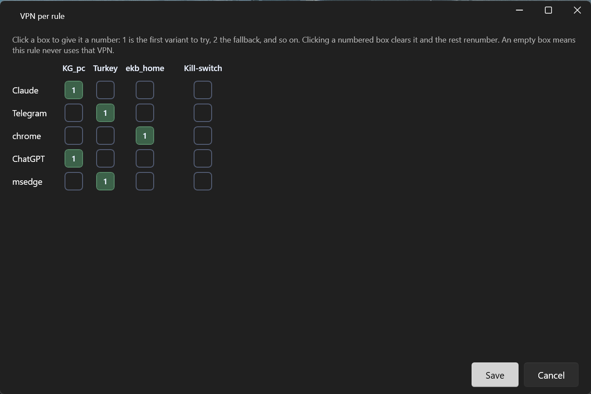

# Mihomo Launcher

**A simple Windows per‑app split VPN launcher on the mihomo (Clash.Meta) engine.**
Set it up once — then it's one click. Each rule bundles an app together with its domain/IP ranges in a single tunnel, so the whole service goes through VPN with no IP leak.

&nbsp;

-444)

**English** · [Русский](README.ru.md)

---

## Download

- **Direct:** https://byfox.dev/data/mihomolauncher/MihomoLauncher.zip
- **From the website:** https://byfox.dev (product page: https://byfox.dev/mihomolauncher/)

Unzip and run `MihomoLauncher.exe` — the mihomo engine installs itself on first launch. Portable, one folder, Windows 10 / 11 (x64). No installer, no telemetry.

Current version: **2.1.4** (mihomo 1.19.31).

> This repository is the project's home page and documentation. The app itself is distributed as a ready‑to‑run archive at the links above.

## What it does

Mihomo Launcher is built for non‑technical users: you configure once *which programs and sites go through VPN and through which node*, and the user just presses **Connect**. The launcher brings up the tunnels, verifies access, and opens the programs.

## Key features

- **Rule = app + IP/domain ranges.** The headline feature. One rule contains the app (or site) *and* its address ranges — add a ready‑made service template and the **entire** service's traffic goes through one tunnel, so your real IP never leaks "around" the rule.
- **Ready‑made range templates.** Pull whole domain/IP rule sets from the open [blackmatrix7 / ios_rule_script](https://github.com/blackmatrix7/ios_rule_script) repository — thousands of services, searchable by name, auto‑updated.
- **A separate tunnel per rule.** Several nodes run at once: one app via France, another via Germany, a third direct. mihomo (Clash.Meta) holds multiple userspace‑WireGuard tunnels simultaneously — no "one tunnel" limit.
- **One routing table for everything.** The **Routing** button on the main screen opens the whole scheme as a single grid: rules as rows, your VPN options as columns. Clicking a cell gives it a number — 1 is the node to try first, 2 the fallback, and so on; an empty cell means that VPN is never used for that rule. A separate column holds the kill‑switch.
- **Multiple VPN source types.** WireGuard `.conf`, `vless://` (VLESS / Reality), `hysteria2://`, Clash / mihomo subscriptions.
- **A kill‑switch in two layers.** Per rule. Until the tunnel is up, the rule has no internet — traffic is rejected by the engine, not sent directly. Windows Firewall rules mirror the same block, so it holds even if the engine crashes, restarts, or the launcher is closed. LAN, printers and remote desktop are never touched.
- **It won't cut off your remote desktop.** The launcher detects the addresses of an active RDP session and keeps them out of the tunnel and out of the blocks. On top of that there's the "Remote desktop session" safe mode: while on, it force‑stops the engine every 60 seconds it's running, so even a hopeless config gives access back within a minute.
- **Connection check by site response.** Availability is judged by the response body (block markers), not the status code, so a Cloudflare‑403 isn't confused with a real block. The launcher auto‑cycles through dozens of nodes, and retries on its own about every 90 seconds until the service opens.
- **Microsoft Store apps** (ChatGPT, Claude, …) via stable AUMID, plus regular `.exe` and websites.
- **Server geolocation on each tile** (country, city) from a local MaxMind GeoLite2 database — fully offline.
- **A live "what is blocked and why" log.** Every connection with a verdict next to it: matched by a rule, cut by the kill‑switch, stripped as an ad/tracker by your machine's own DNS, or a direct connection the launcher never touched. Tabs: *Problems*, *Ads & trackers*, *Outside the launcher*, *Everything*.
- **Bilingual UI (RU / EN)**, switchable on the fly.
- **Built‑in online updates**, per item: the launcher, the mihomo engine, the geo database and the range lists each show their version and date, carry their own check interval, and can be force‑updated from the Updates tab.

## Screenshots

| Routing — which rule goes through which VPN | Rule — app + ranges in one place |
|---|---|
|  |  |

| Settings — VPN options & rules | Range templates (blackmatrix7) |
|---|---|
|  |  |

 Microsoft Store apps (AUMID)

## How it works

Each rule bundles a target (app, website, or Store app by AUMID) with its domain/IP ranges. On **Connect**, the launcher builds a config for each VPN node in turn: already‑assigned rules stay on their nodes, while the rest (plus the launcher itself) probe the current one. Availability is verified by the response body, so a working node sticks and the rest move on — cycling through dozens of nodes until everything opens. Anything that matches no node stays under the kill‑switch (rejected), never sent directly — and Windows Firewall rules hold that same block while the engine is down. Server geolocation comes from local MaxMind databases — no cloud calls.

## Requirements

- Windows 10 or 11 (x64)
- .NET Framework 4.8 (ships with Windows; installed automatically if missing)
- Your own VPN nodes (WireGuard `.conf`, a `vless://` or `hysteria2://` link, or a Clash/mihomo subscription)

## FAQ

**Does my real IP leak?** No. A rule routes the *whole* service (app + its ranges) through one tunnel, and the kill‑switch blocks the rule whenever the tunnel is down.

**What if the engine crashes?** The Windows Firewall rules stay in place, so apps from kill‑switch rules still can't reach the internet around the tunnel — even with the launcher closed. The launcher watches the engine and brings it back, restoring the routes.

**A site won't open — how do I find out why?** Open the live log window: every connection gets a verdict, so you can see at a glance whether a rule, the kill‑switch, your own DNS (ads/trackers) or the app itself is responsible.

**Which engine?** [mihomo](https://github.com/MetaCubeX/mihomo) (Clash.Meta) — WireGuard, VLESS/Reality, Hysteria2, TUN, process/domain routing. Several tunnels at once.

**Is it free? Any telemetry?** Free, no telemetry. Geolocation is a local MaxMind GeoLite2 DB; config stays on your machine. The launcher only goes online for updates (with your confirmation) and rule lists.

## Links

- Website: https://byfox.dev/mihomolauncher/
- Direct download: https://byfox.dev/data/mihomolauncher/MihomoLauncher.zip
- mihomo engine: https://github.com/MetaCubeX/mihomo
- Routing templates: https://github.com/blackmatrix7/ios_rule_script

## Credits & attribution

- This product includes GeoLite2 data created by MaxMind, available from <https://www.maxmind.com>.
- VPN engine: [mihomo (Clash.Meta)](https://github.com/MetaCubeX/mihomo).
- Routing templates: [blackmatrix7 / ios_rule_script](https://github.com/blackmatrix7/ios_rule_script).

## License

Freeware — free to use, no telemetry. Closed source; this repository hosts documentation and download links only.

---

Keywords: per-app VPN, split tunneling, mihomo, Clash.Meta, WireGuard, VLESS, Reality, Hysteria2, Clash subscription, kill-switch, Windows Firewall kill-switch, anti IP-leak, blackmatrix7 rules, per-app routing table, blocked traffic log, Windows VPN launcher, proxy, GeoIP, RDP-safe VPN, ChatGPT / Claude via VPN.
