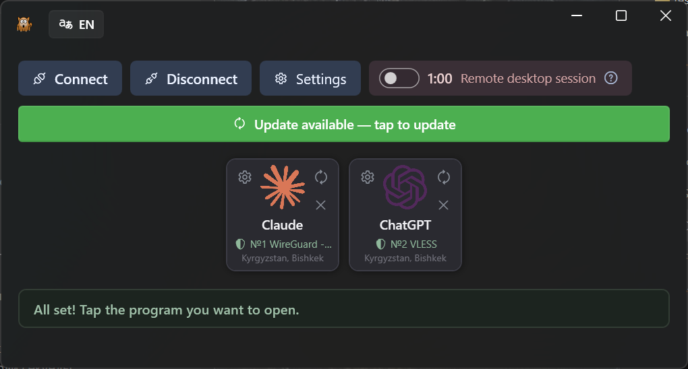
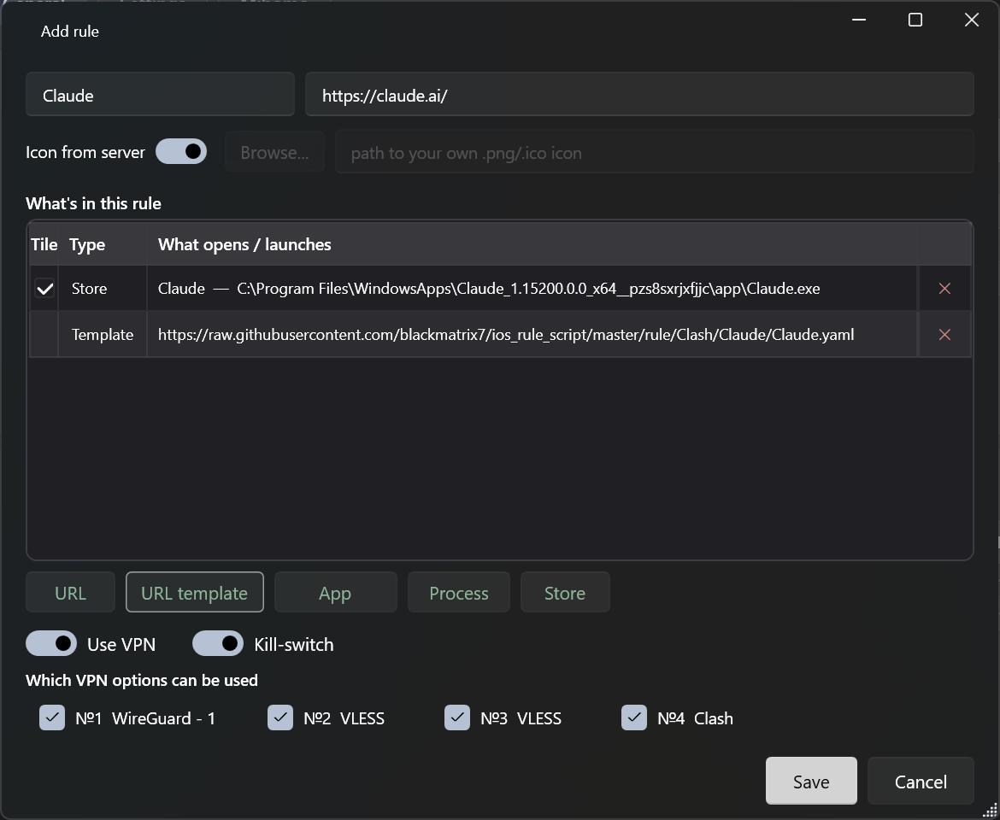
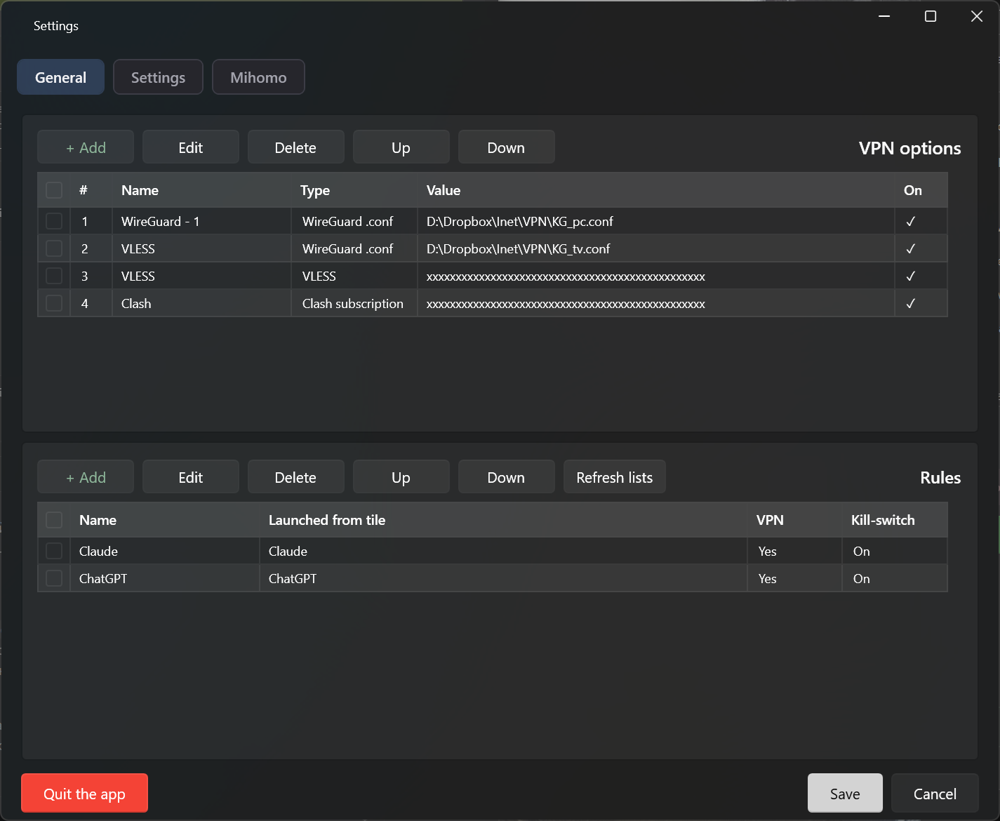
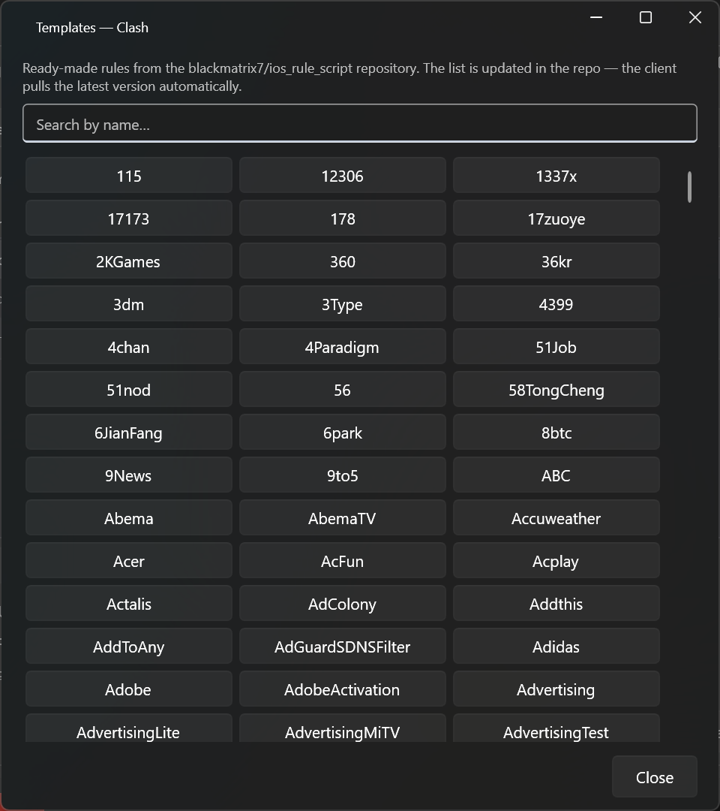
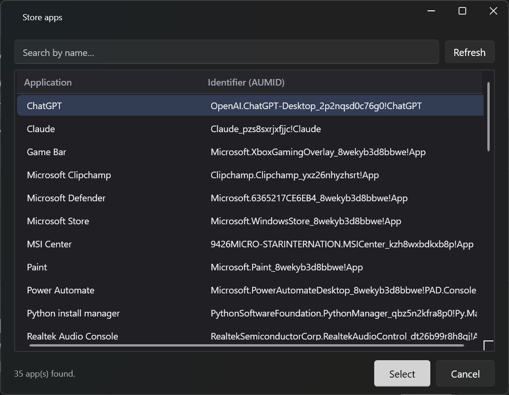

# Mihomo Launcher

**A simple Windows per‑app split VPN launcher on the mihomo (Clash.Meta) engine.**
Set it up once — then it's one click. Each rule bundles an app together with its domain/IP ranges in a single tunnel, so the whole service goes through VPN with no IP leak.

&nbsp;

-444)

**English** · [Русский](README.ru.md)

---

## Download

- **Direct:** https://byfox.dev/data/mihomolauncher/MihomoLauncher.zip
- **From the website:** https://byfox.dev (product page: https://byfox.dev/mihomolauncher/)

Unzip and run `MihomoLauncher.exe` — the mihomo engine installs itself on first launch. Portable, one folder, Windows 10 / 11 (x64). No installer, no telemetry.

> This repository is the project's home page and documentation. The app itself is distributed as a ready‑to‑run archive at the links above.

## What it does

Mihomo Launcher is built for non‑technical users: you configure once *which programs and sites go through VPN and through which node*, and the user just presses **Connect**. The launcher brings up the tunnels, verifies access, and opens the programs.

## Key features

- **Rule = app + IP/domain ranges.** The headline feature. One rule contains the app (or site) *and* its address ranges — add a ready‑made service template and the **entire** service's traffic goes through one tunnel, so your real IP never leaks "around" the rule.
- **Ready‑made range templates.** Pull whole domain/IP rule sets from the open [blackmatrix7 / ios_rule_script](https://github.com/blackmatrix7/ios_rule_script) repository — thousands of services, searchable by name, auto‑updated.
- **A separate tunnel per rule.** Several nodes run at once: one app via France, another via Germany, a third direct. mihomo (Clash.Meta) holds multiple userspace‑WireGuard tunnels simultaneously — no "one tunnel" limit.
- **Multiple VPN source types.** WireGuard `.conf`, `vless://` (VLESS / Reality), Clash / mihomo subscriptions.
- **Always‑on kill‑switch.** Per rule. Until the VPN is up, a VPN‑only app has no internet — traffic is rejected by the engine, not sent directly. A dropped node never leaks your real IP.
- **"Remote desktop session" safe mode.** A switch for setting the launcher up over RDP / AnyDesk: while on, it force‑stops the engine every 60 seconds it's running, so a bad VPN config can't lock you out — access returns within a minute.
- **Connection check by site response.** Availability is judged by the response body (block markers), not the status code, so a Cloudflare‑403 isn't confused with a real block. The launcher auto‑cycles through dozens of nodes until the service opens.
- **Microsoft Store apps** (ChatGPT, Claude, …) via stable AUMID, plus regular `.exe` and websites.
- **Server geolocation on each tile** (country, city) from a local MaxMind GeoLite2 database — fully offline.
- **Bilingual UI (RU / EN)**, switchable on the fly.
- **Built‑in online updates** for the launcher, the mihomo engine and the geo database.

## Screenshots

| Rule — app + ranges in one place | Settings — VPN options & rules |
|---|---|
|  |  |

| Range templates (blackmatrix7) | Microsoft Store apps (AUMID) |
|---|---|
|  |  |

## How it works

Each rule bundles a target (app, website, or Store app by AUMID) with its domain/IP ranges. On **Connect**, the launcher builds a config for each VPN node in turn: already‑assigned rules stay on their nodes, while the rest (plus the launcher itself) probe the current one. Availability is verified by the response body, so a working node sticks and the rest move on — cycling through dozens of nodes until everything opens. Anything that matches no node stays under the kill‑switch (rejected), never sent directly. Server geolocation comes from local MaxMind databases — no cloud calls.

## Requirements

- Windows 10 or 11 (x64)
- .NET Framework 4.8 (ships with Windows; installed automatically if missing)
- Your own VPN nodes (WireGuard `.conf`, a `vless://` link, or a Clash/mihomo subscription)

## FAQ

**Does my real IP leak?** No. A rule routes the *whole* service (app + its ranges) through one tunnel, and the kill‑switch blocks VPN‑only apps whenever the tunnel is down.

**Which engine?** [mihomo](https://github.com/MetaCubeX/mihomo) (Clash.Meta) — WireGuard, VLESS/Reality, TUN, process/domain routing. Several tunnels at once.

**Is it free? Any telemetry?** Free, no telemetry. Geolocation is a local MaxMind GeoLite2 DB; config stays on your machine. The launcher only goes online for updates (with your confirmation) and rule lists.

## Links

- Website: https://byfox.dev/mihomolauncher/
- Direct download: https://byfox.dev/data/mihomolauncher/MihomoLauncher.zip
- mihomo engine: https://github.com/MetaCubeX/mihomo
- Routing templates: https://github.com/blackmatrix7/ios_rule_script

## Credits & attribution

- This product includes GeoLite2 data created by MaxMind, available from <https://www.maxmind.com>.
- VPN engine: [mihomo (Clash.Meta)](https://github.com/MetaCubeX/mihomo).
- Routing templates: [blackmatrix7 / ios_rule_script](https://github.com/blackmatrix7/ios_rule_script).

## License

Freeware — free to use, no telemetry. Closed source; this repository hosts documentation and download links only.

---

Keywords: per-app VPN, split tunneling, mihomo, Clash.Meta, WireGuard, VLESS, Reality, Clash subscription, kill-switch, anti IP-leak, blackmatrix7 rules, Windows VPN launcher, proxy, GeoIP, RDP-safe VPN, ChatGPT / Claude via VPN.
