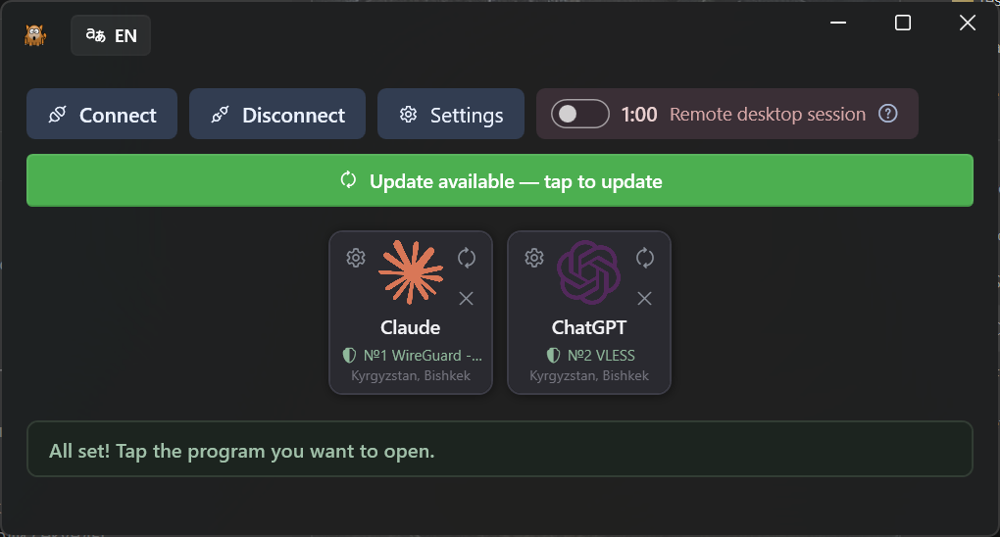
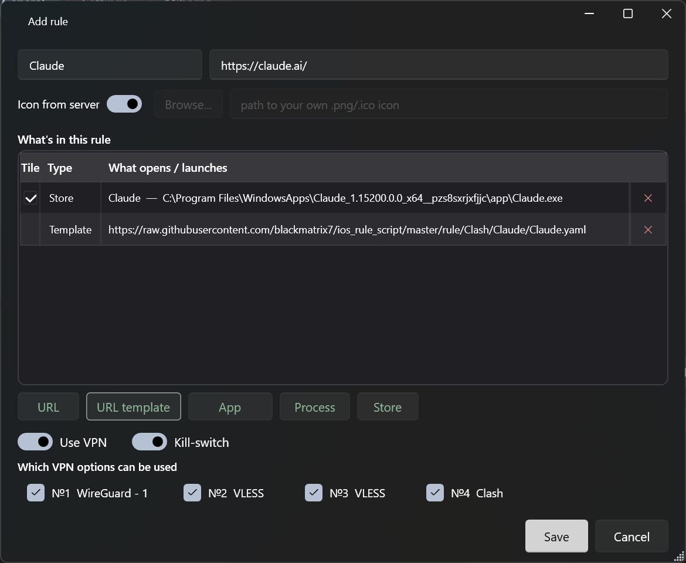
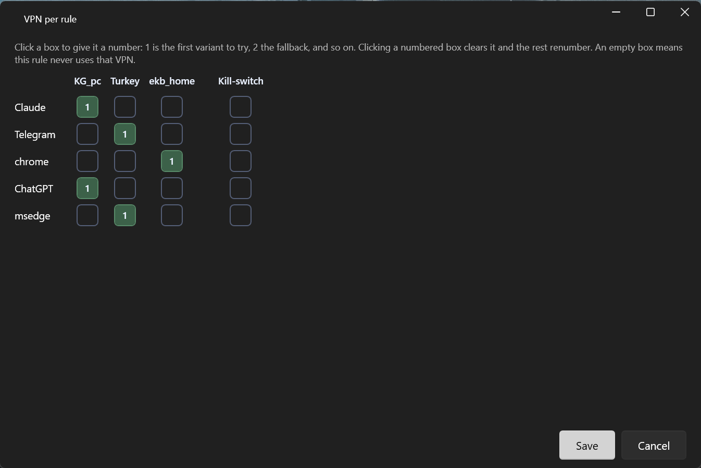
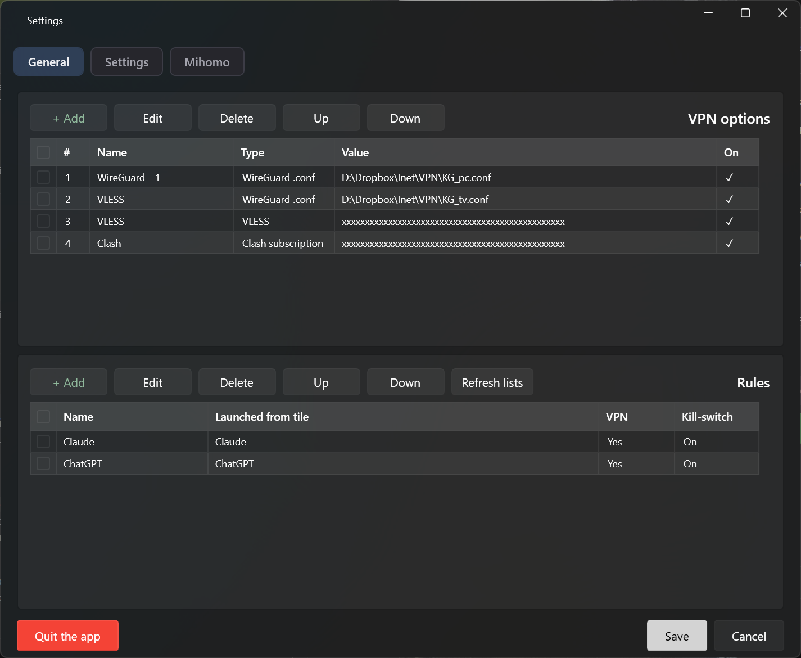
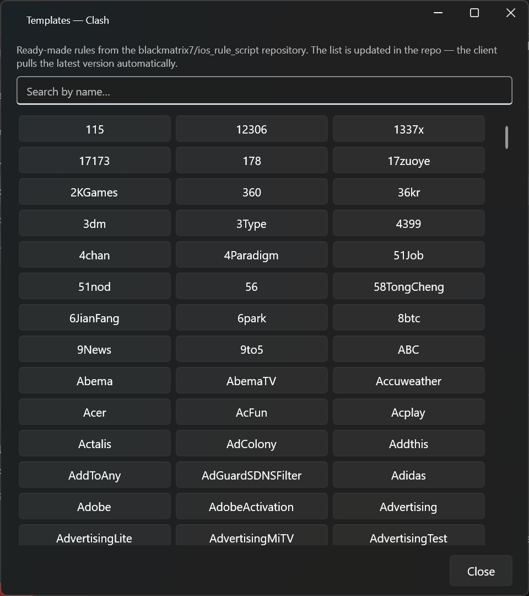
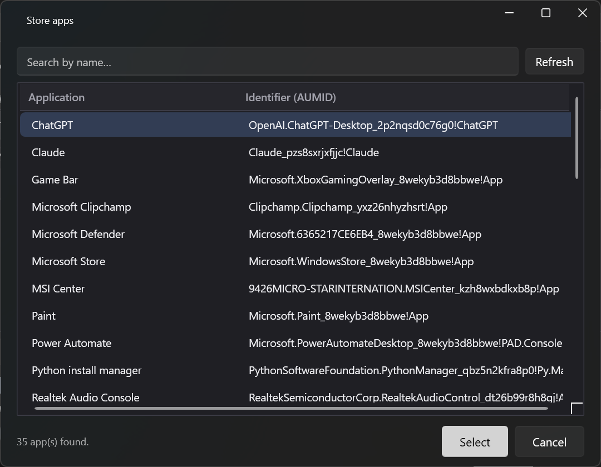

# Mihomo Launcher

**Your own VPN for every app.**

Per‑app split tunneling for Windows: only the apps and sites you choose go through VPN, everything else goes direct.

**English** · [Русский](README.ru.md)

Set it up once — which apps and sites go through which VPN. After that it's one **Connect** button, and the launcher finds a working node by itself.

- **Every VPN protocol** — runs on the mihomo engine: WireGuard, VLESS/Reality, Hysteria 2, Clash subscriptions and more.
- **Tunnel by app and by site** — only what you picked goes through VPN, everything else goes direct.
- **Dozens of VPNs at once** — each app gets its own VPN, primary and fallback, all in one table.
- **Apps from anywhere** — from running processes, via Explorer, or installed from the Microsoft Store.
- **Kill‑switch** — no VPN, no network for the app. Your real IP won't leak.
- **One rule, everything in it** — an app, sites and ready‑made templates: hundreds of services and countries, picked by search, updated automatically.

## Get started

1. Unpack the [archive](https://byfox.dev/data/mihomolauncher/MihomoLauncher.zip)
2. Run `MihomoLauncher.exe` — the engine installs itself
3. Add your VPN and apps — and press **Connect**

Windows 10 / 11 (x64). Freeware, no telemetry. This repository hosts the page and download links only.

---

This product includes GeoLite2 data created by MaxMind, available from <https://www.maxmind.com>. VPN engine: [mihomo](https://github.com/MetaCubeX/mihomo). Rule templates: [blackmatrix7 / ios_rule_script](https://github.com/blackmatrix7/ios_rule_script).

Keywords: per-app VPN, split tunneling, mihomo, Clash.Meta, WireGuard, VLESS, Reality, Hysteria2, kill-switch, Windows VPN launcher.
